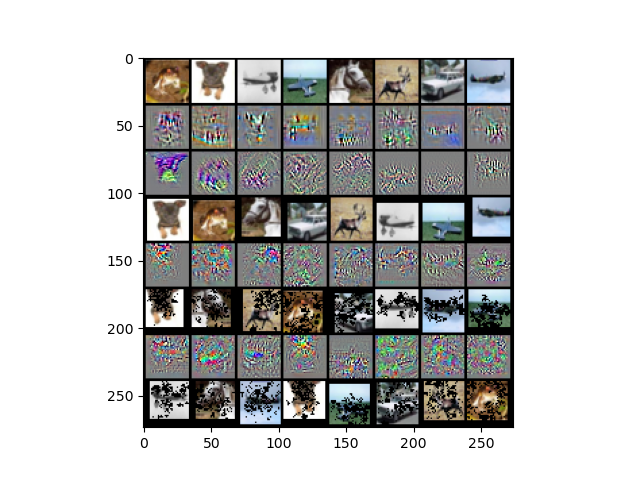

# DataAug_GradPixelDrop

For standard cross-entropy training, deep neural networks tend to produce gradients at the image that are unorganized and have high local variance even on features that are unmeaningful to the problem.  In contrast, adversarially trained and robust networks exhibit smoother gradients at the image that reflect more human salient features (see Dimitris Tsipras, Shibani Santurkar, Logan Engstrom, Alexander Turner, Aleksander Madry: Robustness May Be at Odds with Accuracy. ICLR (Poster) 2019).  Inspired by these behaviors, this repository looks for locally noisy gradients and removes the corresponding pixels, forcing the network to rely on the regions of the image for which it produced smoother gradients.  The goal of the augmentation is to produce a more robust classifier.

An interesting behavior we noticed is that even for standard training, the gradients at the image are quite smooth in the first few epochs of training.  The image below shows the epochal progression of the image gradients for a ResNet18 trained on CIFAR10 and the corresponding pixels that are dropped from an image when it re-appears in the next epoch.

